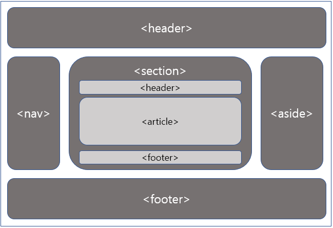

# Semantic Tag 

 

## 시맨틱 태그란? 

> - 의미론적 태그
> - HTML5에 도입된 개발자와 브라우저에게 의미있는 태그. 

### header 

> - 웹 문서의 헤더 영역을 나타낸다.
> - header는 웹 페이지에 대한 소개, 네비게이션 영역, 테이블 영역, 검색 영역, 로고 영역을 포함한 영역이다.
> - header는 제목 태그가 포함 될 수 있으며, 필수 조건은 아니다.
> - header는 섹션 컨텐츠가 아닌 그룹화하기 위한 요소이므로 section요소를 포함할 수 없다.

### main 

> - 웹 문서의 주요 콘텐츠 영역을 나타낼 때 사용한다.
> - main은 웹 페이지에서 한 번만 사용할 수 있으며, 접근성과 검색영역에 노출을 향상시킨다.
> - article, aside, footer, header, nav를 하위 요소로 사용할 수 있다.

### nav 

> - 페이지 내에서 이동 할 수 있는 네비게이션 링크 그룹이다.
> - nav는 문서의 핵심적인 페이지의 메뉴 및 서브 메뉴에서 사용하고, 문서에서 주로 한 번만 사용한다.
> - 문서 안에 링크가 포함된 콘텐츠는 nav를 사용하지 않는다.
> - nav는 핵심적인 네비게이션에 사용해야 하므로 footer 내에 링크 그룹의 사용은 적절하지 않다.

### section 

> - 일반적으로 문서의 콘텐츠 섹션을 의미
> - 콘텐츠와 관련된 한 가지 주제 영역을 말한다.
> - section 요소는 문장이나 문서의 스타일링 요소가 아니기 때문에 편의나 영역을 위함이라면 div 요소가 좋다.
> - section 요소는 제목이 없는 경우는 섹션이라고 할 수 없기때문에 제목을 제공해야 한다.
> - section 요소는 일반적인 주제가 아니라면 구체적인 요소(article, aside, nav)를 사용하는 것이 더 적절하다.

### article 

> - 콘텐츠의 독립적인 항목을 나타내는 콘텐츠를 의미
> - article은 포럼, 신문기사, 잡지, 블로그 항목, 게시판 글 등 콘텐츠의 독립적인 항목을 나타냄
> - section은 하나의 주제를 나타낸다면, article은 주제를 묶은 독립적인 콘텐츠를 의미
> - section 요소 안에는 article 요소를 포함시킬수 있으며, article 요소 안에도 section 요소를 쓸 수 있다.

### aside 

> - 웹 문서의 메인 콘텐츠와 관련된 사이드 컨텐츠 영역으로 나타낸다.
> - aside는 메인 콘텐츠와 관련된 사이드의 정보, 광고 등 부분적인 정보를 구룹할 때 사용한다.

### footer 

> - 웹 문서의 footer 영역을 나타낸다.
> - footer는 저작권 정보, 회사 정보, 관련 링크, 주소, 바닥글, 사이트 정보 등을 포함하는 콘텐츠 영역이다.
> - footer는 섹션 컨텐츠가 아닌 그룹을 나타내는 요소이며, section, article, aside 등을 포함 할 수 있다.
