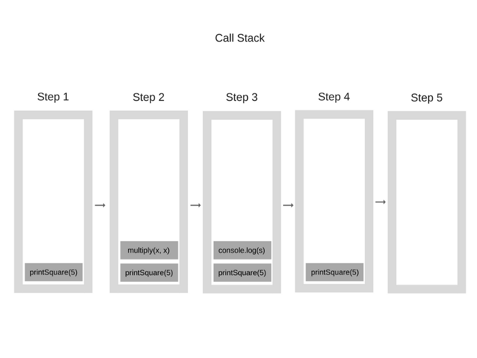
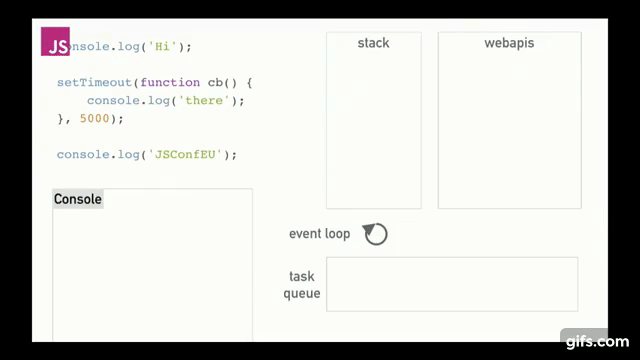

# How JavaScript works 

<br>

## 1. 엔진 

> 자바스크립트를 해석한는 JavaScript Engine과 웹 브라우저에 화면을 그리는 Rendering Engine은 다른 것이다. Rendering Engine은 HTML과 CSS로 작성된 마크업 관련한 코드들을 콘텐츠로서 웹 페이지에 'Rendering'하는 역할을 한다. <br> 
>  JavaScript Engine이란 JavaScript로 작성한 코드를 해석하고 실행하는 인터프리터이다. JavaScript Engine으로 구글의 V8엔진이 있다. V8엔진은 크롬과 Node.js에서 사용된다. V8엔진을 간단히 표시한 모습은 이렇다. 


- Memory Heap : 메모리 할당이 이루어지는 곳이다. 
- Call Stack : 코드가 실행되면서 스택 프레임이 쌓이는 곳이다. 

<br>

## 2. 콜스택 

> 자바스크립트는 싱글 쓰레드(single-thread) 프로그래밍 언어이다. 다시 말하면 콜스택이 하나라는 뜻이다. 따라서 한번에 하나의 일만 할 수 있다. <br>
> 콜스택은 기본적으로 우리가 프로그램의 어디에 있는지를 기록하는 자료 구조이다. 
```
function multiply (x, y) {
    return x * y; 
}

function printSquare (x) {
    var s = multiply(x, x); 
    console.log(s);
}

printSquare(5); 
```
엔진이 이 코드의 수행을 시작 할 때 콜 스택은 비어 있는 상태이다. 이후의 단계는 이렇게 된다. 


### 2-1. 스택트레이스

> 콜스택의 각각은 <b>스택프레임 (Stack Frame)</b> 라고 부른다. <br>
> 또한 예외가 발생했을 때 스택트레이스가 만들어지는 방식이다. 스택 트레이스란 기본적으로 예외가 발생했을 때 콜스택의 상태이다. <br>

```
function foo() {
    throw new Error('SessionStack will help you resolve crashes :)');
}

function bar() {
    foo();
}

function start() {
    bar();
}

start();

```
> 만약 이 코드를 크롬에서 실행하면 다음과 같은 스택트레이스가 생성된다. 


### 2-2. 스택날림(Blowing the stack) 

> 스택 날림이란 콜 스택의 최대 크기에 다다랐을 때 나타난다. 이런 현상은 재귀함수를 면밀히 테스트하지 않은 경우 종종 일어날수 있다. 
```
function foo() {
    foo();
}

foo();
```


## 3. 이벤트 루프 

그럼 비동기 콜백(asynchronous callback)은 어떻게 이뤄지나? 

```
console.log('Hi');

setTimeout(function() {
  console.log('there');
}, 5000);

console.log('JSconf');
```

> 이 코드는 먼저 'Hi'라는 콘솔이 찍히고, setTimeout이 실행되고 'JSconf'라는 콘솔이 찍히고 5초후에 'there'이라는 콘솔이 찍힐 것이다. <br>
> 그런데 setTimeout 함수가 아직 끝나지 않았는데 어떻게 'JSconf'라는 콘솔이 찍힌걸까?<br> 이걸 동시에 할 수 있는 이유는 바로 브라우저가 단순 런타임 이상의 작업을 하기 때문이다. 


> 자바스크립트는 단일 쓰레드이기 때문에 한번에 하나의 일 밖에 할 수 없지만, <b> 브라우저가 Web API 같은 것들을 제공한다.</b> 이들은 자바스크립트에서 호출 할 수 있는 쓰레드를 제공해준다. <br>
> 따라서 위의 코드는 실제로 이와 같은 방식으로 진행된다. 



> setTimeout이 실행되면 브라우저로 넘어가 타이머를 실행시키고 카운트 다운을 시작한다. 
> <br> 이 말은 setTimeout의 호출 자체는 완료되었고, 스택에서 지울 수 있게 된 것이다. 
> <br>
> 카운트 다운이 끝나게 되면 해당 결과물은 Task Queue에 들어가게 된다. 
> <br> <b>EventLoop는 Call Stack과 Task Queue를 주시하며 스택이 비어있으면, Queue에 있는 콜백들을 순서대로 쌓아주는 역할을 하는 것이다. </b>


<br>


## 참고 사이트 
1. https://engineering.huiseoul.com/%EC%9E%90%EB%B0%94%EC%8A%A4%ED%81%AC%EB%A6%BD%ED%8A%B8%EB%8A%94-%EC%96%B4%EB%96%BB%EA%B2%8C-%EC%9E%91%EB%8F%99%ED%95%98%EB%8A%94%EA%B0%80-%EC%97%94%EC%A7%84-%EB%9F%B0%ED%83%80%EC%9E%84-%EC%BD%9C%EC%8A%A4%ED%83%9D-%EA%B0%9C%EA%B4%80-ea47917c8442

2. https://asfirstalways.tistory.com/362

3. https://huurray.github.io/js/2019/01/05/js-callStack/