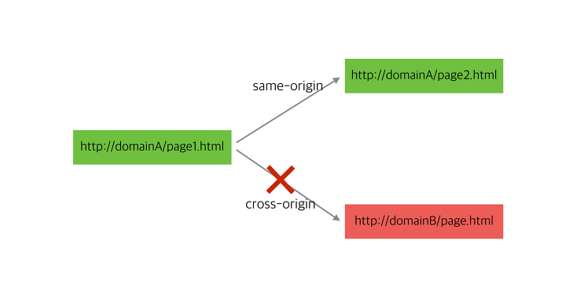
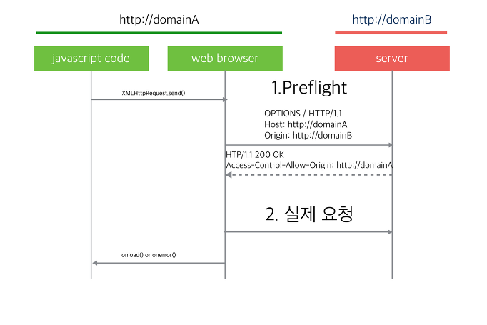

# CORS

> 교차 출처 리소스 공유(Cross-origin resource sharing, CORS) 
> - 웹 페이지 상의 제한된 리소스를 최초 자원이 서비스된 도메인 밖의 다른 도메인으로부터 요청할 수 있게 허용하는 구조이다. 
> - 도메인에서 실행중인 웹 응용 프로그램이 다른 출처의 서버에서 선택된 자원에 액세스 할 수 있는 권한을 갖도록 브라우저에 알리기 위해 추가 HTTP 헤더를 사용하는 메커니즘이다. 
> - 요청을 받은 웹서버가 허용할 경우에는 다른 도메인의 웹 페이지 스크립트에서도 자원을 주고 받을 수 있게 해준다. 

 

## 1. 개요 

웹 개발시 JavaScript로 외부 서버의 경로로 ajax요청을 날리면 에러가 나면서 요청이 실패한다.   웹 브라우저의 콘솔 창에 아래와 같은 메시지를 보게 된다. 

#### 크롬 
> No 'Access-Control-Allow-Origin' header is present on the requested resource. Origin '[요청한 도메인]' is therefore not allowed access. 

#### 파이어폭스 
> 교차 원본 요청 차단 : 동일 출처 정책으로 인해 [요청한 도메인]에 있는 원격 자원을 읽을 수 없습니다. 자원을 같은 도메인으로 이동시키거나 CORS를 활성하여 해결할 수 있습니다. 

※ 외부로 요청이 안되는 것은 자바스크립트 엔진 표준 스펙에 동일 출처 정책(same-orign policy) 이라는 보안 규칙이 있기 때문이다. 

 

### 동일 출처 정책 
> 일반적으로 서로 다른 출처에서 가져온 문서는 격리되어 있다.  예를들어 http://example.com/doc.html 에서 가져온 문서가 https://example.com/target.html 에서 가져온 문서의 DOM에 액세스 하려고 하면 사용자 에이전트는 액세스를 허용하지 않는다.   동일 출처 정책이 API간에 다르지만 가장 중요한 의도는 사용자가 정직한 웹사이트를 통한 사용자 세션을 방해하는 웹사이트없이 신뢰할 수 없는 웹 사이트를 방문하도록 하는 것이다. 

이 정책에 의해서 자바스크립트(XMLHttpRequest)로 다른 웹페이지에 접근할 때는 같은 출처(same origin)의 페이지에만 접근이 가능하다.  
*같은 출처 : 프로토콜, 호스트명, 포트가 같다는것을 의미  
즉, 웹페이지의 스크립트는 그 페이지와 같은 서버에 있는 주소로만 ajax 요청을 할 수 있다. 

이 정책이 초기에는 웹사이트의 보안을 위한 좋은 방법으로 생각되었으나 요즘은 여러 도메인에 걸쳐서 구성되는 대규모 웹 프로젝트가 늘어나고, REST API 등을 이용한 외부 호출이 많아지는 상황에서는 거추장스러운 기술이 되기도 한다.  
그래서 만들어진 추가 정책이 CORS이다. 이 정책의 특징은 서버에서 외부 요청을 허용할 경우 ajax요청이 가능해지는 방식이다. 

 

### 서버의 도움 없이 동일 출처 정책을 회피하여 외부 서버로 날릴 수 있는 방법

#### 1. 웹 브라우저 실행 시 외부 요청을 허용하는 옵션을 사용 
#### 2. 외부 요청을 가능하게 해주는 플러그인 설치 
#### 3. JSONP방식으로 요청 

 

## 2. CORS 작동방식 

### preflight request(사전 요청)
> 요청하려는 URL이 외부 도메인일 경우 웹 브라우저는 preflight요청을 먼저 날리게 된다.   preflight 요청은 실제로 요청하려는 경로와 같은 URL에 대해 OPTIONS 메서드로 요청을 미리 날려보고 요청을 할 수 있는 권한이 있는지 확인하는 것이다. 

 

## 3. 서버에서 CORS 요청 핸들링 

서버롤 날아온 preflight 요청을 처리하여 웹 브라우저에서 실제 요청을 날릴 수 있도록 해준다.

### 모든 외부 도메인에서 모든 요청을 허용할 경우 처리 

- 가장 쉬운 방법으로 모든 요청을 허용하는 방식이다. 
- preflight 요청을 받기 위해 OPTIONS 메서드의 요청을 받아서 컨트롤해야 한다. 
- 모든 요청의 응답에 아래 header를 추가한다.

       Access-Control-Allow-Origin : * 
       Access-Control-Allow-Methods : GET, POST, PUT, DELETE, OPTIONS 
       Access-Control-Max-Age : 3600
       Access-Control-Allow-Headers : Origin, Accept, X-Requested-With, 
                                      Content-Type, Accesss-Control-Request-Method, 
                                      Access-Control-Request-Headers, Authorization 

웹 브라우저의 스크립트 엔진에서 preflight 요청 응답으로 Access-Control-Allow-Origin header에 "*" 값이 있으면 모든 도메인에서의 요청을 허용하는 것으로 판단한다.

 

## 4. 결론 

### 1. Server Side 

> 동일 출처 정책을 회피하기 위한 다양한 방법이 있으므로 서버가 이 스펙을 지원한다고 해서 다른 보안정책을 마련하지 않으면 안된다. 일반적인 웹 브라우저에서 스크립트에 의한 ajax 요청만 적용을 받을 수 있다고 생각해야 할 것이다. 

### 2. Client Side 

> JavaScript의 스펙을 이해하고 개발 상황에 맞는 적절한 해결 방식을 선택할 수 있어야 한다.   외부 서버로 ajax요청이 안될 경우 아래와 같은 단계로 철리를 생각해 볼 수 있다. 
> 1. 개발자가 테스트 혹은 개발 단계에서 쉽게 요청하기 : 웹브라우저 실행 옵션인나 플러그인을 통한 동일 출처 정책 회피 
> 2. CORS구현이 안되어 있는 서버로 ajax요청을 해야 하지만 서버 쪽 컨트롤이 불가능할 경우 : jsonp방식으로 요청 
> 3. Ajax요청을 해야 하는 다른 도메인의 서버를 클라이언트와 같이 개발하거나 서버 개발 쪽 수정 요청이 가능한 경우 : 서버에서 CORS 요청이 허용되도록 구현  

 

## 참고 사이트

https://www.w3.org/Security/wiki/Same_Origin_Policy 
https://ko.wikipedia.org/wiki/%EA%B5%90%EC%B0%A8_%EC%B6%9C%EC%B2%98_%EB%A6%AC%EC%86%8C%EC%8A%A4_%EA%B3%B5%EC%9C%A0 
https://brunch.co.kr/@adrenalinee31/1