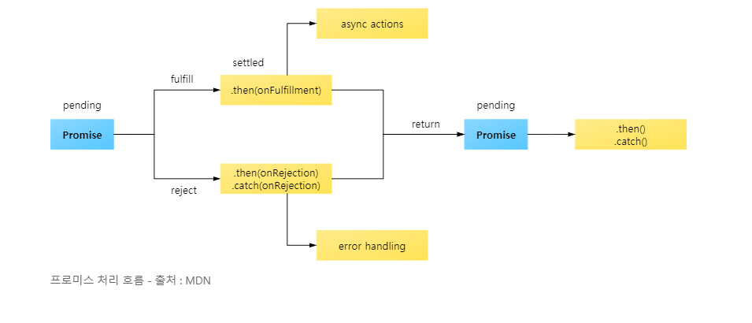

# Promise 

> 자바스크립트 비동기 처리에 사용되는 객체 

### Callback 함수 

콜백 함수의 동작 방식은 일종의 식당 자리 예약과 같다. 일반적으로 맛집을 가면 사람이 많아 자리가 없다. 그래서 대기자 명단에 이름을 쓴 다음에 자리가 날 때까지 주변 식당을 돌아다니게 된다. 만약 식당에서 자리가 생기면 전화로 자리가 났다고 연락이 온다면, 그 전화를 받는 시점이 여기서의 콜백 함수가 호출되는 시점과 같다. 손님 입장에서는 자리가 날 때까지 식당에서 기다리지 않고 근처 가게에서 잠깐 쇼핑을 할 수도 있고 아니면 다른 식당 자리를 알아볼 수도 있다.

자리가 났을 때만 연락이 오기 때문에 미리 가서 기다릴 필요도 없고, 직접 식당 안에 들어가서 자리가 비어 있는지 확인할 필요도 없다. 자리가 준비된 시점, 즉 데이터가 준비된 시점에서만 저희가 원하는 동작(자리에 앉는다, 특정 값을 출력한다 등)을 수행할 수 있다.

```
function getData(callbackFunc) {
	$.get('https://domain.com/products/1', function (response) { // $.get()이 ajax 통신을 하는 부분 
		callbackFunc(response); // 서버에서 받은 데이터 response를 callbackFunc() 함수에 넘겨줌
	});
}

getData(function (tableData) {
	console.log(tableData); // $.get()의 response 값이 tableData에 전달됨
});
```

### Callback Hell 

```
$.get('url', function (response) {
	parseValue(response, function (id) {
		auth(id, function (result) {
			display(result, function (text) {
				console.log(text);
			});
		});
	});
});

```
callback이 중첩될 때마다 점점 코드가 안으로 들어간다. 이렇게 계속해서 들여쓰기가 일어나 가독성을 해치는 현상을 <b>callback hell</b>이라고 부른다. <br>
개발자는 닫는 태그가 어떤 여는 태그와 한 쌍인지 헷갈려 곤란한 상황을 경험할 수 있다. 또한 콜백 하나마다 모든 에러를 처리해야 해서 번거로운데 이를 해결 할 수 있는 패턴이 <b>Promise</b>패턴이다.

### Promise의 3가지 상태(states) 
프로미스를 사용할 때 알아야 하는 가장 기본적인 개념이 바로 프로미스의 상태이다.<br>
여기서 말하는 상태란 프로미스의 처리 과정을 의미함. 
- Pending(대기) : 비동기 처리 로직이 아직 완료되지 않은 상태 
- Fulfilled(이행) : 비동기 처리가 완료되어 프로미스가 결과 값을 반환해준 상태 
- Rejected(실패) : 비동기 처리가 실패하거나 오류가 발생한 상태 

#### Pending(대기) 
먼저 아래와 같이 new Promise() 메서드를 호출하면 Pending(대기) 상태가 된다. 
```
new Promise(); 
```
이렇게 new Promise() 메서드를 호출할 때 콜백 함수의 인자로 resolve, reject에 접근 할 수 있다. 
```
new Promise(function(resolve, reject) {
    //...
});
```

#### Fulfilled(이행) 
콜백 함수의 인자 resolve를 아래와 같이 실행하면 Fulfilled(이행)상태가 된다. 
```
new Promise(function (resolve, reject) {
    resolve();
});
```
그리고 이행 상태가 되면 아래와 같이 <b>then()</b>을 이용하여 처리 결과 값을 받을 수 있다. 
```
function getData() {
    return new Promise(function (resolve, reject) {
        let data = 100; 
        resolve(data);
    });
}

// resolve()의 결과 값 data를 resolveData로 받음 
getData().then(function (resolveData) {
    console.log(resolveData); // 100 
});
```

#### Rejected(실패) 
reject 인자로 reject() 메서드를 실행하면 Rejected(실패) 상태가 된다. 
```
new Promise(function (resolve, reject) {
    reject();
});
```
실패상태가 되면 실패한 이유를 catch()로 받을 수 있다. 
```
function getData() {
  return new Promise(function (resolve, reject) {
    reject(new Error("Request is failed"));
  });
}

// reject()의 결과 값 Error를 err에 받음
getData().then().catch(function (err) {
  console.log(err); // Error: Request is failed
});
```



Promise가 좋은 점은 코드를 분리할 수 있다. 
```
const promise1 = new Promise((resolve, reject) => { ... });
const promise2 = new Promise((resolve, reject) => { ... });
if (조건문) {
  promise1.then((result) => {...});
} else {
  promise2.then((result) => {...});
}
```


<br>

## 참고 사이트 
1. https://joshua1988.github.io/web-development/javascript/javascript-asynchronous-operation/<br>
2. https://www.zerocho.com/category/EcmaScript/post/5770c27e6a8e09150013f0f7